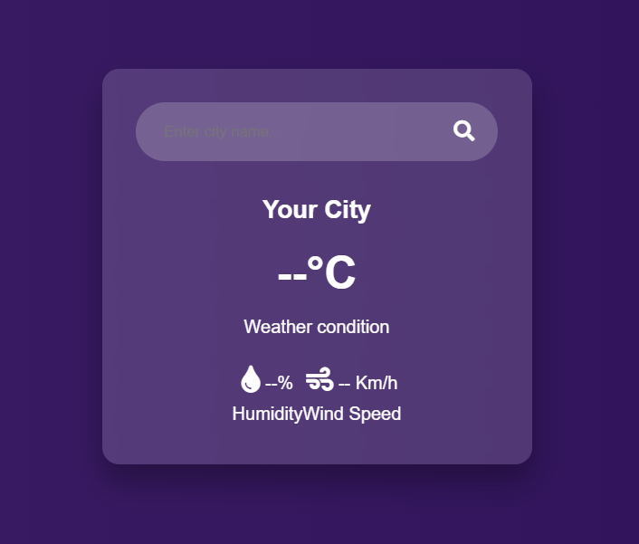
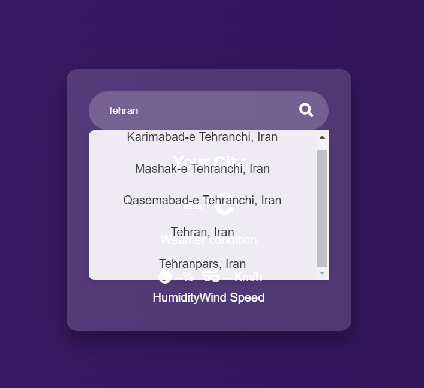
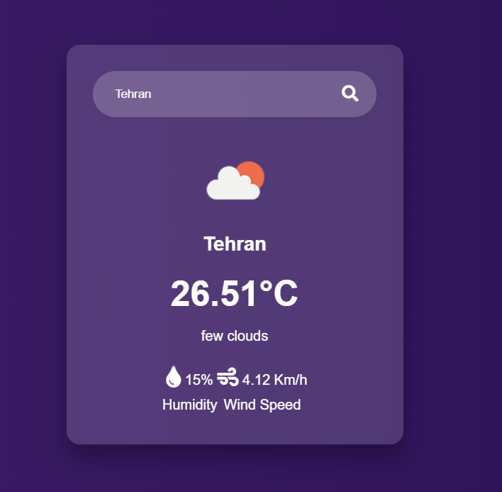

# Weather App Project

This project is a simple weather forecast application built with **JavaScript**, **HTML**, and **CSS**. It allows users to search for a city and display current weather information such as temperature, humidity, wind speed, and weather conditions in a clean, responsive interface.

## Table of Contents
- [Screenshot](#screenshot)
- [Features](#features)
- [Built With](#built-with)
- [Setup Instructions](#setup-instructions)
- [Usage](#usage)
- [Contact](#contact)

## Screenshot







<p align="right">(<a href="#table-of-contents">back to top</a>)</p>

## Features

- Search for weather information by city name.
- Autocomplete suggestions for city names as you type.
- Display of current temperature, weather conditions, humidity, and wind speed.
- Fetches data in real-time from an external API.
- Responsive and modern UI.

<p align="right">(<a href="#table-of-contents">back to top</a>)</p>

## Built With

This project was built using the following technologies:

* 
* 
* 

<p align="right">(<a href="#table-of-contents">back to top</a>)</p>

## Setup Instructions

### Prerequisites

To run this project, you need:

1. A modern web browser that supports HTML, CSS, and JavaScript.
2. API keys from **OpenWeatherMap** and **GeoDB Cities** for fetching weather and city data.

### How to Get API Keys

#### 1. **OpenWeatherMap API**:
- Visit [OpenWeatherMap](https://openweathermap.org/api).
- Create a free account.
- Navigate to the **API Keys** section in your dashboard and generate an API key.
- This key will be used to fetch weather data.

#### 2. **GeoDB Cities API**:
- Visit [GeoDB Cities API on RapidAPI](https://rapidapi.com/wirefreethought/api/geodb-cities).
- Sign up for a free account or log in with your existing RapidAPI account.
- Subscribe to the **GeoDB Cities API**.
- Copy your **API key** from the RapidAPI dashboard.

### Configuration

1. Once you have your API keys, open the `config.js` file in the project.
2. Replace the placeholder text with your actual API keys:

```javascript
// config.js

const config = {
    weatherApiKey: 'YOUR_OPENWEATHERMAP_API_KEY',  // Replace with your OpenWeatherMap API key
    geoDbApiKey: 'YOUR_GEODB_API_KEY',             // Replace with your GeoDB Cities API key
    geoDbApiUrl: 'https://wft-geo-db.p.rapidapi.com/v1/geo/cities',
    weatherApiUrl: 'https://api.openweathermap.org/data/2.5/weather'
};
```

3. Save the config.js file.

<p align="right">(<a href="#table-of-contents">back to top</a>)</p>

## Usage

1. Clone the project from GitHub or download the files:
   ```bash
   git clone https://github.com/AmirrezaAhmadi/WeatherApp-Vanilla-Js.git

2. Open the Weather App.Html file in your browser to use the weather application.

3. Type a city name in the search bar and select a suggestion from the autocomplete dropdown

4. Weather information such as temperature, humidity, and wind speed will be displayed once the data is fetched from the API. 

<p align="right">(<a href="#table-of-contents">back to top</a>)</p>

## Contact

You can reach me through the following:

* Email: AmirrezaAhmadi.GH@Gmail.com
* Telegram: https://t.me/AmirrezaDevelop
* Instagram: https://www.instagram.com/codewithamirreza
* Project Link: https://github.com/AmirrezaAhmadi/WeatherApp-Vanilla-Js.git

<p align="right">(<a href="#table-of-contents">back to top</a>)</p>
